# 🔗 LINKHUB INTEGRATOR - PIANO IMPLEMENTAZIONE COMPLETA

## 📋 SOMMARIO ESECUTIVO

**LinkHub Integrator** è un'applicazione standalone che funge da ponte sicuro tra LinkHub e tool esterni (CRM, Data Analysis, Task Management). Utilizza **NextJS + NextAuth + Auth0 Provider** per consistenza architetturale e **Convex separato** per isolamento dei dati.

**Architettura**: NextJS + NextAuth + Auth0 Provider + Convex Project Separato
**Autenticazione**: Auth0 (stessa applicazione di LinkHub main)
**Database**: Convex isolato per configurazioni e log integrazioni
**Deployment**: Dominio separato con environment staging/production

---

## 🎯 1. CONTESTO E OBIETTIVI

### 📝 Background
LinkHub è un'applicazione OKR completa con autenticazione multi-provider (Discord, Credentials, Auth0). LinkHub Integrator semplifica le integrazioni con LinkHub main fornendo:

- **Import/Export semplificato** di Initiatives, Indicators e Values
- **API unificate** per connessione con tool esterni (CRM, Data Analysis, Task Management)
- **Dashboard centralizzata** per configurazione e monitoraggio integrazioni
- **Autenticazione trasparente** tramite stesso sistema Auth0 di LinkHub

### 🎯 Obiettivi Principali
1. **Semplificare integrazioni** con LinkHub main (Initiatives, Indicators, Values)
2. **Standardizzare API** per tool esterni senza modifiche a LinkHub core
3. **Isolamento sicuro** dei dati per company con autenticazione unificata
4. **Scalabilità** per nuovi provider di integrazione
5. **Zero impatto** sull'architettura esistente di LinkHub

---

### 🔄 Flusso Autenticazione

```mermaid
graph TD
    A[User → integrator.domain] --> B{Non autenticato?}
    B -->|Sì| C[Reindirizza a Sign-in Auth0]
    B -->|No| D[Accesso Dashboard]
    C --> E[Login con credenziali LinkHub esistenti]
    E --> F[NextAuth valida token con LinkHub API]
    F --> G{Token valido e company integrator abilitata?}
    G -->|No| H[Accesso negato]
    G -->|Sì| I{Profilo integrator esiste?}
    I -->|No| J[Crea automaticamente profilo integrator]
    I -->|Sì| K[Aggiorna ultimo accesso]
    J --> L[Dashboard Access]
    K --> L
```

