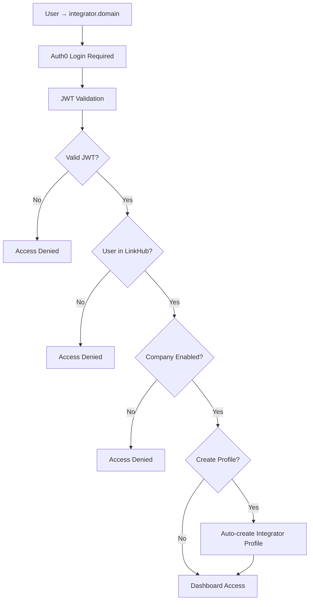

# 🔗 LINKHUB INTEGRATOR - PIANO IMPLEMENTAZIONE COMPLETA

## 📋 SOMMARIO ESECUTIVO

**LinkHub Integrator** è un'applicazione standalone che funge da ponte sicuro tra LinkHub e tool esterni (CRM, Data Analysis, Task Management). Utilizza **NextJS + NextAuth + Auth0 Provider** per consistenza architetturale e **Convex separato** per isolamento dei dati.

**Architettura**: NextJS + NextAuth + Auth0 Provider + Convex Project Separato
**Autenticazione**: Auth0 (stessa applicazione di LinkHub main)
**Database**: Convex isolato per configurazioni e log integrazioni
**Deployment**: Dominio separato con environment staging/production

---

## 🎯 1. CONTESTO E OBIETTIVI

### 📝 Background
LinkHub è un'applicazione OKR completa con autenticazione multi-provider (Discord, Credentials, Auth0). LinkHub Integrator estende questa architettura fornendo:

- **Import sicuro** di dati da tool esterni
- **Export automatizzato** verso sistemi di terze parti
- **Dashboard unificata** per gestione integrazioni
- **API scalabile** per provider custom

### 🎯 Obiettivi Principali
1. **Bridge sicuro** tra LinkHub e tool esterni
2. **User experience seamless** per amministratori company
3. **Scalabilità** per nuovi provider senza modifiche core
4. **Company isolation** completo
5. **Minimal impact** su LinkHub esistente

---

### 🔄 Flusso Autenticazione



### 🗄️ Schema Database (Convex Separato)

#### **integratorProfiles** - Collegamento Utenti
```typescript
{
  auth0UserId: v.string(),              // Subject JWT Auth0
  companyId: v.id("companies"),         // Company LinkHub main
  companySlug: v.string(),              // Per query ottimizzate
  permissions: v.object({
    canReadIndicators: v.boolean(),
    canWriteValues: v.boolean(),
    canManageIntegrations: v.boolean(),
    canViewLogs: v.boolean(),
  }),
  isActive: v.boolean(),
  lastLoginAt: v.optional(v.number()),
  createdAt: v.number(),
  updatedAt: v.number(),
}
```

#### **providerConfigs** - Configurazioni Provider
```typescript
{
  profileId: v.id("integratorProfiles"),
  provider: v.union(
    v.literal("hubspot"),
    v.literal("powerbi"),
    v.literal("planner"),
    v.literal("custom")
  ),
  config: v.object({
    // Provider-specific configuration
    apiKey: v.optional(v.string()),     // Encrypted
    webhookUrl: v.optional(v.string()),
    mappings: v.optional(v.array(v.object({
      sourceField: v.string(),
      targetField: v.string(),
      transformation: v.optional(v.string()),
    }))),
    syncSettings: v.optional(v.object({
      frequency: v.union("manual", "hourly", "daily", "weekly"),
      enabled: v.boolean(),
    })),
  }),
  isActive: v.boolean(),
  lastSyncAt: v.optional(v.number()),
  createdAt: v.number(),
  updatedAt: v.number(),
}
```

#### **syncLogs** - Log Operazioni
```typescript
{
  profileId: v.id("integratorProfiles"),
  provider: v.string(),
  operation: v.union(v.literal("import"), v.literal("export")),
  entityType: v.string(),              // "indicators", "values", "initiatives"
  recordsProcessed: v.number(),
  success: v.boolean(),
  errorMessage: v.optional(v.string()),
  metadata: v.optional(v.any()),       // Dettagli operazione
  durationMs: v.optional(v.number()),  // Performance tracking
  timestamp: v.number(),
}
```

#### **apiKeys** - Chiavi API Esterne
```typescript
{
  profileId: v.id("integratorProfiles"),
  provider: v.string(),
  name: v.string(),                    // Nome descrittivo
  encryptedKey: v.string(),           // Convex encrypted
  permissions: v.array(v.string()),   // Scopo chiave
  isActive: v.boolean(),
  lastUsedAt: v.optional(v.number()),
  expiresAt: v.optional(v.number()),
  createdAt: v.number(),
}
```

### 🔐 Sicurezza e Autorizzazioni

#### **JWT Validation Multi-Layer**
1. **Auth0 Token**: Audience e issuer validation
2. **LinkHub User**: Verifica esistenza utente
3. **Company Status**: Verifica integrator abilitato
4. **Profile Creation**: Auto-creazione se necessario

#### **Company Isolation**
- Tutte le query filtrate per `companyId`
- Provider configs legate a company specifica
- API keys scoped per company
- Logs separati per company

---

## 🎯 3. FUNZIONALITÀ CORE

### 🔐 1. Authentication & Authorization
- **Auth0 Login** (solo signin, no signup)
- **JWT Multi-Issuer** support (compatibilità LinkHub)
- **Auto Profile Creation** nel DB integrator
- **Company-based Permissions**
- **Session Management** con refresh token

### 📊 2. Dashboard Principale
- **Provider Overview** cards con status
- **Quick Actions** per connessione/sconnessione
- **Sync Status** real-time
- **Performance Metrics** (last sync, success rate)
- **Error Notifications** centralizzate

### 🔌 3. Provider Management

#### **HubSpot Integration**
- **Import**: Deals → Indicators mapping
- **Sync**: Pipeline values → LinkHub values
- **Webhook**: Deal updates → real-time sync
- **OAuth**: HubSpot API v3 authentication

#### **PowerBI Integration**
- **Export**: OKR metrics → PowerBI datasets
- **Push Rows**: Automated data refresh
- **Service Principal**: App-only authentication
- **Scheduled Updates**: Daily/weekly sync

#### **Microsoft Planner Integration**
- **Export**: Initiatives → Planner tasks
- **Bidirectional**: Status sync tra sistemi
- **OAuth2**: Microsoft Graph API
- **Assignee Mapping**: User matching

#### **Custom Providers Framework**
- **OpenAPI Spec** per documentazione
- **Plugin Architecture** per nuovi provider
- **Webhook Support** generico
- **Testing Tools** per integrazioni custom

### 🔄 4. Data Import/Export Engine

#### **Import Operations**
- **Scheduled Sync**: Convex crons configurabili
- **Manual Triggers**: UI buttons per sync immediati
- **Delta Updates**: Incremental sync support
- **Error Recovery**: Retry logic e fallback

#### **Export Operations**
- **Event-Driven**: Webhook su eventi LinkHub
- **Bulk Operations**: Batch processing ottimizzato
- **Transformation Pipeline**: Field mapping e conversioni
- **Rate Limiting**: API quota management

#### **Sync Engine**
```typescript
// Core sync logic
export const syncProviderData = action({
  args: {
    profileId: v.id("integratorProfiles"),
    provider: v.string(),
    operation: v.union(v.literal("import"), v.literal("export")),
  },
  handler: async (ctx, args) => {
    // 1. Validate permissions
    // 2. Load provider config
    // 3. Execute sync operation
    // 4. Log results
    // 5. Handle errors with retry
  },
});
```

### 📈 5. Monitoring & Analytics

#### **Real-time Dashboard**
- **Sync Status** per provider
- **Performance Metrics** (latency, throughput)
- **Error Rates** e alerting
- **Usage Statistics** per company

#### **Logging System**
- **Structured Logs** per tutte le operazioni
- **Error Tracking** con stack traces
- **Audit Trail** per compliance
- **Performance Monitoring** end-to-end

---

## 🚀 4. DEPLOYMENT STRATEGY

### 🏠 Environment Setup

#### **Development Environment**
```bash
# .env.local
AUTH0_DOMAIN="dev-tenant.auth0.com"
AUTH0_CLIENT_ID="dev_integrator_client"
AUTH0_CLIENT_SECRET="dev_secret"

# Convex Integrator Project
NEXT_PUBLIC_CONVEX_URL="https://dev-integrator.convex.site"
CONVEX_URL="https://dev-integrator.convex.cloud"

# LinkHub Main API
NEXT_PUBLIC_LINKHUB_API_URL="http://localhost:3000/api"
```

#### **Production Environment**
```bash
# Production .env
AUTH0_DOMAIN="your-tenant.auth0.com"
AUTH0_CLIENT_ID="prod_integrator_client"
AUTH0_CLIENT_SECRET="prod_secret"

# Production Convex
NEXT_PUBLIC_CONVEX_URL="https://integrator-prod.convex.site"
CONVEX_URL="https://integrator-prod.convex.cloud"

# Production LinkHub
NEXT_PUBLIC_LINKHUB_API_URL="https://your-linkhub-domain.com/api"
```

### 📦 Deployment Pipeline

#### **Vercel/Netlify Deployment**
- **Automatic Deploy** da Git
- **Environment Variables** per stage
- **Branch Protection** per production
- **Rollback Support** per hotfix


### 🌐 Domain & SSL
- **Domain**: `integrator.yourdomain.com`
- **SSL Certificate**: Automatic via Vercel/Netlify
- **CORS Configuration**: Permesso per Auth0 callbacks
- **Security Headers**: HSTS, CSP, etc.

---

## 🔒 5. SICUREZZA E COMPLIANCE

### 🛡️ Security Measures

#### **Authentication Security**
- **JWT RS256** validation obbligatoria
- **Audience Check** (`https://linkhub-api`)
- **Issuer Validation** (Auth0 + NextAuth compatibility)
- **Token Expiry** handling automatico

#### **Data Protection**
- **Encryption at Rest**: Convex built-in encryption
- **API Keys**: Encrypted storage con scoped permissions
- **Audit Logs**: Tutte le operazioni tracciate
- **Rate Limiting**: API quota enforcement

#### **Network Security**
- **CORS Policy**: Strict origin validation
- **API Gateway**: Request validation middleware
- **HTTPS Only**: Forced SSL everywhere
- **Webhooks**: HMAC signature validation

### 🔐 API Security

#### **LinkHub Main APIs**
```typescript
// Example: Protected endpoint
export const getCompanyData = query({
  args: { companyId: v.id("companies") },
  handler: async (ctx, args) => {
    // 1. JWT validation
    const identity = await ctx.auth.getUserIdentity();
    if (!identity) throw new Error("Unauthorized");

    // 2. Company access check
    // 3. Return company data
  },
});
```

#### **External APIs**
```typescript
// Provider API calls
export const callHubspotAPI = action({
  args: {
    profileId: v.id("integratorProfiles"),
    endpoint: v.string(),
    method: v.union(v.literal("GET"), v.literal("POST")),
    data: v.optional(v.any()),
  },
  handler: async (ctx, args) => {
    // 1. Load encrypted API key
    // 2. Decrypt and validate
    // 3. Make authenticated call
    // 4. Handle rate limits
  },
});
```

---

## ⚠️ 7. CONSIDERAZIONI CRITICHE

### 🔑 Dependencies & Compatibility
- **NextJS 15**: Latest stable version
- **NextAuth v5**: Server-side authentication con Auth0 provider
- **Convex**: Latest version con encryption
- **TypeScript**: Strict mode obbligatorio

### 🚨 Risk Mitigation
- **Gradual Rollout**: Feature flags per provider
- **Fallback Mechanisms**: Manual sync se automatico fallisce
- **Data Validation**: Schema validation su tutti i dati
- **Error Boundaries**: Graceful degradation

### 🔄 Maintenance & Support
- **Monitoring**: Dashboard real-time
- **Logging**: Structured logs per troubleshooting
- **Documentation**: API docs sempre aggiornate
- **Support**: Admin tools per debugging

---

## 🎉 8. CONCLUSIONI

**LinkHub Integrator** rappresenta l'evoluzione naturale di LinkHub verso un ecosistema integrato. L'architettura proposta garantisce:

- ✅ **Scalabilità** per nuovi provider
- ✅ **Sicurezza** enterprise-grade
- ✅ **User Experience** seamless
- ✅ **Maintainability** a lungo termine
- ✅ **Performance** ottimizzata

---

## 📞 PROSSIMI PASSI

1. **Creazione progetto** NextJS con template
2. **Setup NextAuth** con Auth0 provider (stessa app LinkHub)
3. **Convex schema** implementation
4. **Basic authentication** flow con middleware
5. **Dashboard UI** development
6. **Provider integration** progressiva